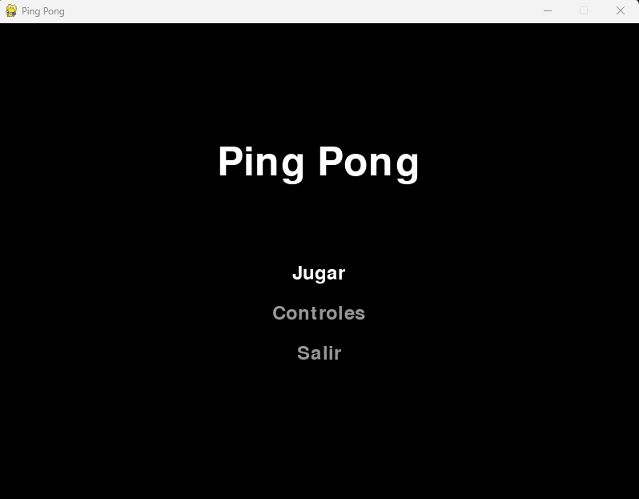
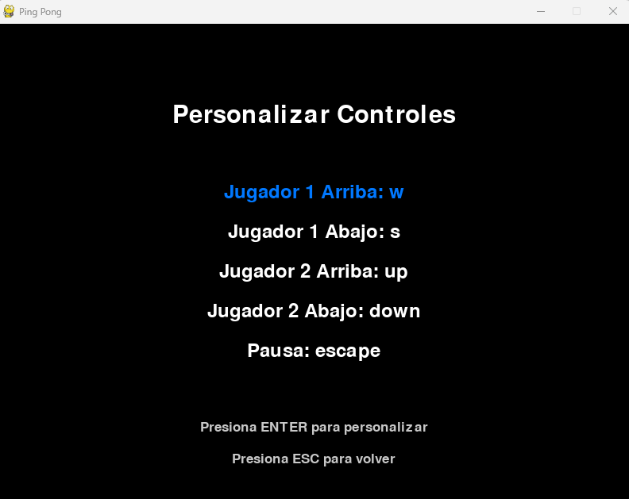
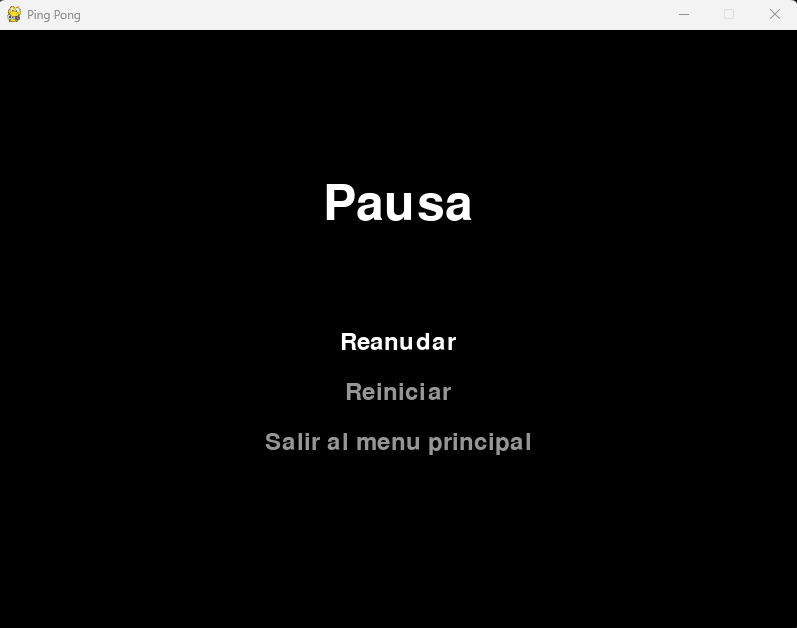
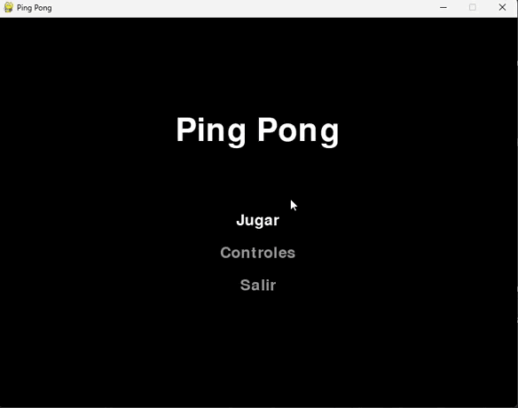

# Ping Pong en Pygame

## Descripción

Este proyecto es una implementación moderna y personalizable del clásico juego Ping Pong, desarrollado en Python utilizando la biblioteca Pygame. Ofrece una experiencia de juego fluida y atractiva, con controles personalizables y un diseño visual limpio.

## Capturas

### Menu principal

### Controles

### Menu de pausa

### Juego

## Características

- Juego para dos jugadores
- Menú principal interactivo
- Configuración de controles personalizable
- Sistema de puntuación
- Menú de pausa
- Efectos visuales suaves

## Requisitos

- Python 3.x
- Pygame

## Cómo jugar

- Usa las teclas W/S para mover la paleta izquierda
- Usa las flechas Arriba/Abajo para mover la paleta derecha
- Presiona ESC para pausar el juego

## Personalización

Puedes personalizar los controles desde el menú principal:

1. Selecciona "Controles" en el menú principal
2. Elige el control que deseas cambiar
3. Presiona la nueva tecla para asignarla

---
